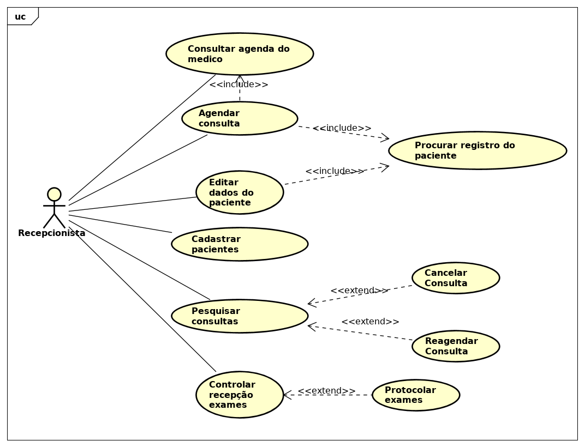
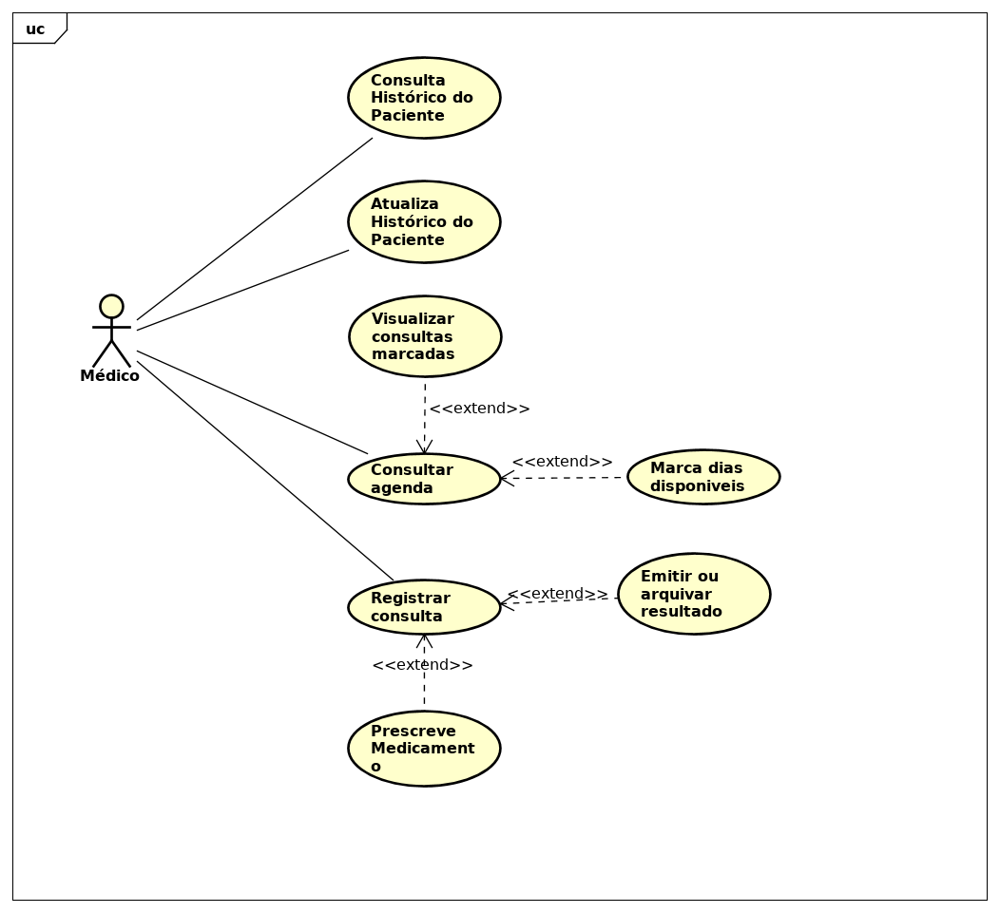
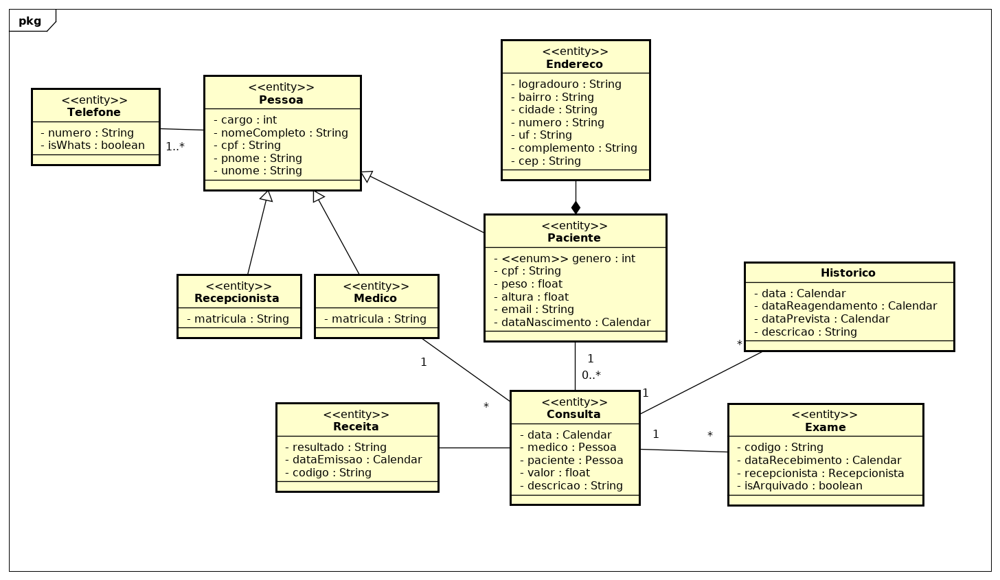

## Sistema simples de clinica

#### Descrição

O produto deve dar suporte à gestão de clínica onde trabalha uma equipe de médicos. Será usado pelos recepcionistas para marcação de consultas e também pelos médicos, para registro do histórico dos pacientes. Deve ser controlada a recepção de resultados de exames que sejam enviados diretamente dos laboratórios para os médicos; por opção do médico, estes resultados podem ser entregues aos pacientes, ou guardados na clínica para consulta posterior.

#### Tarefas

|    Data    | Maykon | Renato | Leandro | Renata |
| ---------- | ------ | ------ | ------- | ------ |
| 10/10/2018 |  [ ]   |  [ ]   |   [ ]   |  [ ]   |
| 17/10/2018 |  [ ]   |  [ ]   |   [ ]   |  [ ]   |
| 24/10/2018 |  [ ]   |  [ ]   |   [ ]   |  [ ]   |

#### Artefatos

- **Casos de uso Recepcionista**

- **Casos de uso Médico**

- **Diagrama de Classes**

